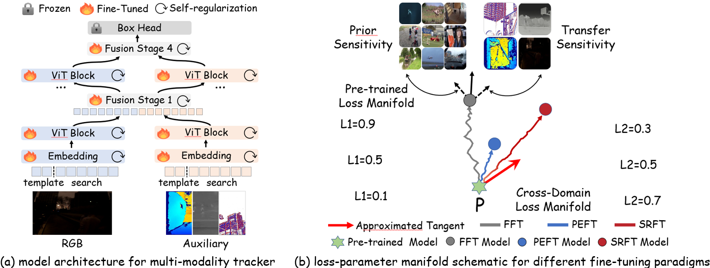

  <h3 align="center"><strong>Optimizing Multi-Modal Trackers via Sensitivity-aware Regularized Tuning [SRTrack] </strong></h3>
    

    <a>Zhiwen Chen</a>1,2&nbsp;&nbsp;
    <a>Jinjian Wu</a>1&nbsp;&nbsp;
    <a>Zhiyu Zhu</a>2&nbsp;&nbsp;
    <a>Yifan Zhang</a>2&nbsp;&nbsp;
    <a> Guangming Shi</a>1&nbsp;&nbsp;
    <a>Junhui Hou</a>2&nbsp;&nbsp;
     
    1Xidian University&nbsp;&nbsp;&nbsp;
    2City University of Hong Kong&nbsp;&nbsp;&nbsp;

  
  
  

##  About
This paper tackles the critical challenge of optimizing multi-modal trackers by effectively adapting the pre-trained models for RGB data. Existing fine-tuning paradigms oscillate between excessive freedom and over-restriction, both leading to a suboptimal plasticity-stability trade-off. To mitigate this dilemma, we propose a novel sensitivity-aware regularized tuning framework, which delicately refines the learning process by incorporating intrinsic parameter sensitivities. Through a comprehensive investigation from pre-trained to multi-modal contexts, we identify that parameters sensitive to pivotal foundational patterns and cross-domain shifts are primary drivers of this issue. Specifically, we first analyze the tangent space of pre-trained weights to measure and orient prior sensitivities, dedicated to preserving generalization. Then, we further explore transfer sensitivities during the tuning phase, emphasizing adaptability and stability. By incorporating these sensitivities as regularization terms, our method significantly enhances the transferability across modalities. Extensive experiments showcase the superior performance of the proposed method, surpassing current state-of-the-art techniques across various multi-modal tracking. 

  

