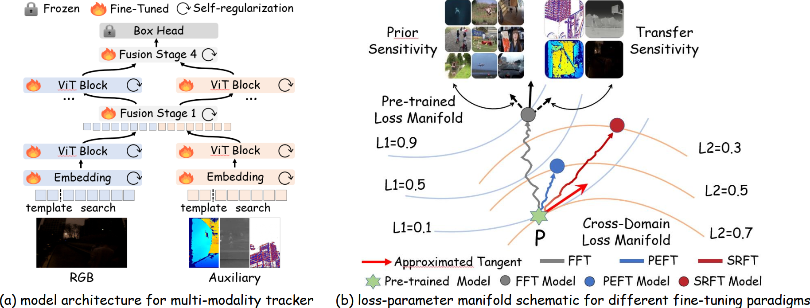

<div align="center">
  <h3 align="center"><strong>Optimizing Multi-Modality Trackers via Significance-Regularized Tuning [SRTrack] </strong></h3>
    <p align="center">
    <a>Zhiwen Chen</a><sup>1,2</sup>&nbsp;&nbsp;
    <a>Jinjian Wu</a><sup>1</sup>&nbsp;&nbsp;
    <a>Zhiyu Zhu</a><sup>2</sup>&nbsp;&nbsp;
    <a>Yifan Zhang</a><sup>2</sup>&nbsp;&nbsp;
    <a> Guangming Shi</a><sup>1</sup>&nbsp;&nbsp;
    <a>Junhui Hou</a><sup>2</sup>&nbsp;&nbsp;
    <br>
    <sup>1</sup>Xidian University&nbsp;&nbsp;&nbsp;
    <sup>2</sup>City University of Hong Kong&nbsp;&nbsp;&nbsp;
</div>


<p align="center">
  <a href="https://arxiv.org/abs/2508.17488" target='_blank'>
    
  </a>
  
  <a href="" target='_blank'>
    
  </a>
</p>


##  About
This paper tackles the critical challenge of optimizing multi-modality trackers by effectively adapting pre-trained models for RGB data. Existing fine-tuning paradigms oscillate between excessive flexibility and over-restriction, both leading to suboptimal plasticity-stability trade-offs. To mitigate this dilemma, we propose a novel significance-regularized fine-tuning framework, which delicately refines the learning process by incorporating intrinsic parameter significance. Through a comprehensive investigation of the transition from pre-trained to multi-modality contexts, we identify that parameters crucial to preserving foundational patterns and managing cross-domain shifts are the primary drivers of this issue. Specifically, we first probe the tangent space of pre-trained weights to measure and orient prior significance, dedicated to preserving generalization. Subsequently, we characterize transfer significance during the fine-tuning phase, emphasizing adaptability and stability. By incorporating these parameter significance terms as unified regularization, our method markedly enhances transferability across modalities. Extensive experiments showcase the superior performance of our method, surpassing current state-of-the-art techniques across various multi-modal tracking benchmarks.
<div align="center">
  
</div>

##  Getting Started

###  Installation

### Data Preparation
#### Pretrained Datasets

#### Downstream Datasets

### Pretrained Models


## 🚀 Training

##  Evaluation

## 📚 Citation
If you use SRTrack/SRFT in your research, please use the following BibTeX entry.

```
@article{chen2025optimizing,
  title={Optimizing Multi-Modal Trackers via Sensitivity-aware Regularized Tuning},
  author={Chen, Zhiwen and Wu, Jinjian and Zhu, Zhiyu and Zhang, Yifan and Shi, Guangming and Hou, Junhui},
  journal={arXiv preprint arXiv:2508.17488},
  year={2025}
}
```

